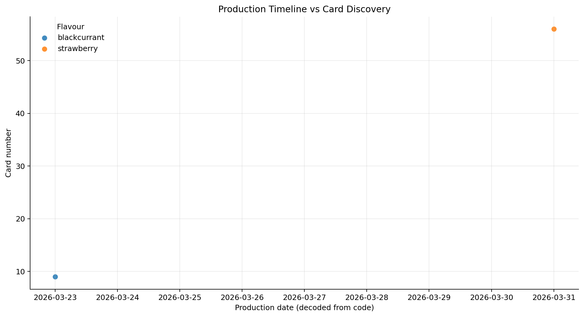
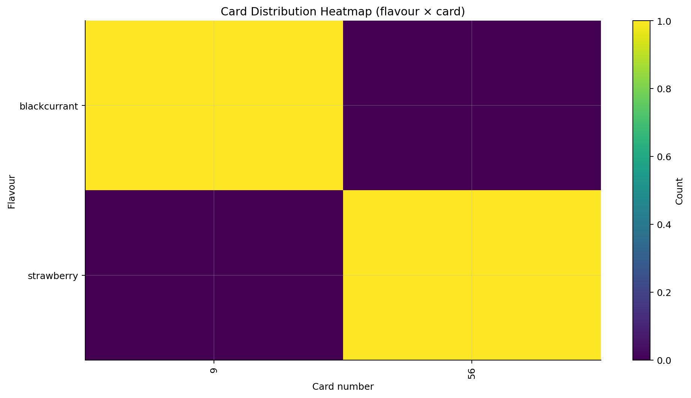
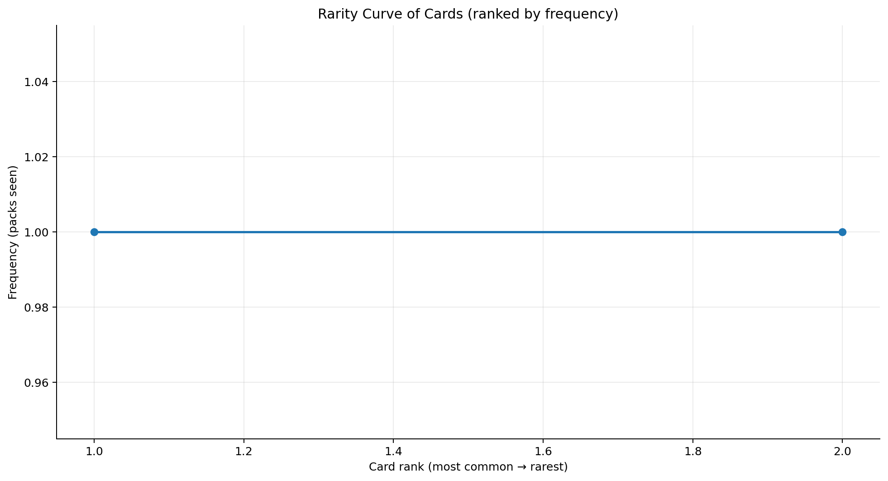
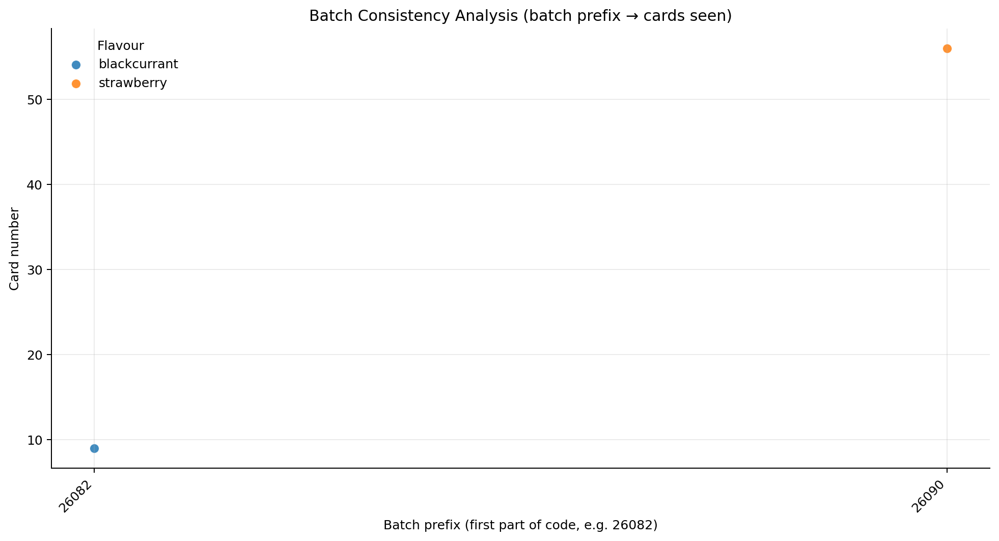
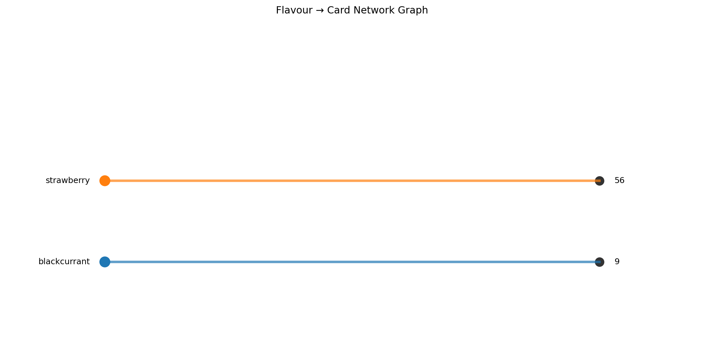
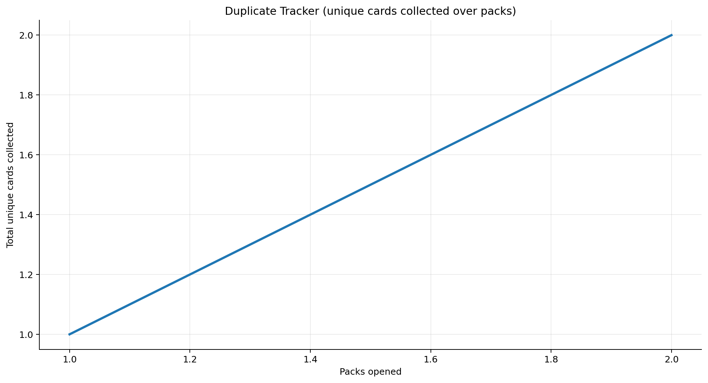
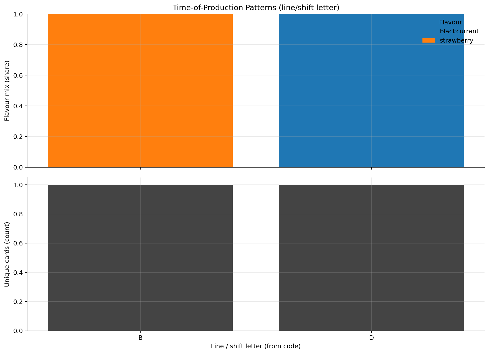
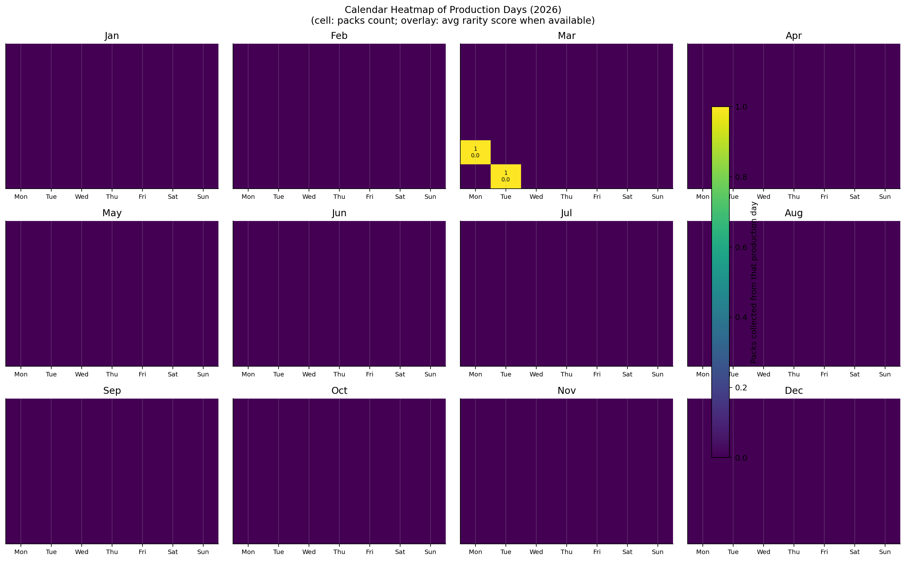

## Bear cards — little collection write-up

I log each pack I open (and what card I got), then generate a few plots to see if anything weird is going on with **production**, **distribution**, and (inevitably) **duplicates**.

To regenerate the plots:

```bash
uv sync
uv run python src/generate_plots.py
```

Plots are saved in `plots/`.

## Figures

### Figure 1 — Production Timeline vs Card Discovery

This one is a timeline: **production date** on the x-axis, **card number** on the y-axis, and **color = flavour**. It’s great for spotting flavour “waves” (strawberry week?) and any card-number clustering.



### Figure 2 — Card Distribution Heatmap

This is the quick “is anything fishy?” view: x = **card number**, y = **flavour**, and the cell color is **how many times you’ve seen that combo**. You’ll immediately see rare cards and any cards that look weirdly flavour-tied.



### Figure 3 — Rarity Curve of Cards

Cards sorted from **most common → rarest**, plotted by how often they show up. If the distribution is lopsided, you’ll usually get a nice long-tail curve (and you can eyeball “tiers” from the shape).



### Figure 4 — Batch Consistency Analysis

Here each x-position is a **batch prefix** (like `26082`), y is **card number**, and color is **flavour**. This tells you whether a batch only coughs up a small subset of cards (poor mixing) or whether it looks nicely shuffled.



### Figure 5 — Flavour → Card Network Graph

Flavours on one side, cards on the other. A line means you’ve seen that pairing (thicker = more often). This is where you spot “wide” cards (everywhere) vs “narrow” ones (maybe tied to a line/batch).



### Figure 6 — Duplicate Tracker (Collector Pain Index)

x = **packs opened**, y = **unique cards collected so far**. You can literally see when the curve starts flattening into “cool, another duplicate”.



### Figure 7 — Time-of-Production Patterns

Grouped by the line/shift letter (from the `"15D"` part of the code). Top is flavour mix; bottom is how many unique cards each line has produced in your sample. If one line is cursed, it’ll start showing up here.



### Figure 8 — Calendar Heatmap

Each square is a **production day**: color = **how many packs you logged from that day**, and the overlay is the **average rarity score** (when available). It’s a nice view of what you’ve sampled — and whether any days look consistently “better”.



## Notes / data format (previous README)

The data in [data/packs.csv] contains information about the packs of cards as I (and my colleagues) find them.

The columns are:

- flavour: the flavour of the cards
- acquisition_date: the date the pack was acquired
- best_before_date: the date the pack is best before
- production_code: the production code of the pack
- production_time: the time the pack was produced
- card_number: the number of the card

To the best of my knowledge, the production code is an identifier composed of:

- The year of production, encoded as the last two digits of the year
- The calendar day of production, encoded as the day of the year (1-365) with leading zeros to make it a three-digit number
- Possibly, the batch number or line cycle, encoded as a two-digit number
- Possibly, the factory line / shift / plant identifier, encoded as a single letter

The data in [data/cards.csv] contains information about the cards themselves.

The columns are:

- card_number: the number of the card
- name: the name of the card
- code: the code of the card
